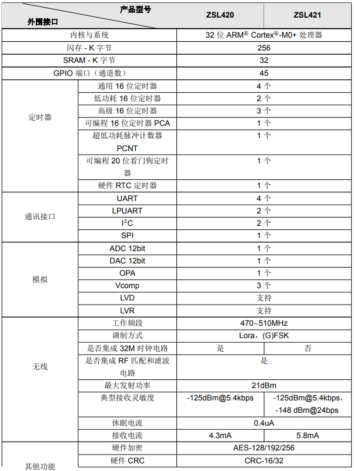

# [ZSL420](https://github.com/SoCXin/ZSL420)

#### [Vendor](https://github.com/SoCXin/Vendor)：[ZLG](https://www.zlgmcu.com)
#### [Core](https://github.com/SoCXin/Cortex)：[Cortex M0](https://github.com/SoCXin/CM0)
#### [Level](https://github.com/SoCXin/Level)：48 MHz x 0.95 DMIPS/MHz
## [简介](https://github.com/SoCXin/ZSL420/wiki)

[ZSL420](https://github.com/SoCXin/ZSL420)是致远电子自主研发的LoRa智能组网芯片。该产品集成无线收发器，超低功耗MCU，射频收发匹配电路和滤波电路。支持自组网透传协议、LoRaNET、LoRaWAN、LinkWAN、CLAA等软件组网协议。且芯片支持二次开发，拥有256K字节Flash，32K字节SRAM，45个通用IO口，多个SPI,IIC,UART数字接口，内置ADC,DAC等模拟外设，支持AES-256硬件加密。

### 射频性能参数

* 1.工作频段：470~510MHz
* 2.发射功率：可调，最大21dBm
* 3.接收灵敏度：-148dBm（速率0.024kb/s），-125dBm（速率5.4kb/s）
* 4.休眠电流：0.9uA（最低电流），1.7uA（RAM保存，运行协议栈）
* 5.接收电流：4.3mA（MCU内核休眠）
* 6.发射电流：108mA（21dBm发射），65mA（17dBm发射）

#### 关键特性

* 470MHz∼510MHz无线收发器，-9dBm∼21dBm@Step1dB
* 45个通用管脚
* 12位ADC
* 6位DAC
* OPA+CMP

### [资源收录](https://github.com/SoCXin/ZSL420)

* [参考文档](docs/)
* [参考资源](src/)
* [参考工程](project/)

### [选型建议](https://github.com/SoCXin)

[ZSL420](https://github.com/SoCXin/ZSL420) 主要是支持LoRa通信

###  [www.SoC.xin(芯)](http://www.SoC.Xin)
