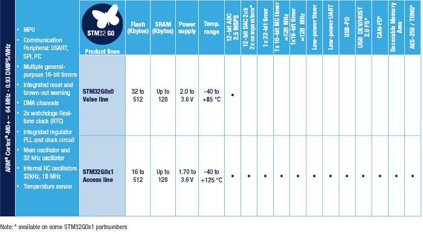

# [STM32G0](https://github.com/sochub/STM32G0)

 
#### 厂商：[ST](https://github.com/sochub/ST)
#### 父级：[STM32](https://github.com/sochub/STM32)
#### 架构：[cortex M0](https://github.com/sochub/CM0)

## [描述](https://github.com/sochub/STM32G0/wiki) 

[ST](https://github.com/sochub/ST) 意法半导体全新的 Arm® Cortex®-M0+ 微控制器。STM32G0除了继承F0系列的优良特性外拥有很多新的特性，力求在每个细节实现最出色的优化，为用户提供最佳的性价比，以灵活的特性满足各种应用需求。

 

1）STM32G0仅需一组电源引脚，不仅降低了BOM成本还可以减少PCB面积，这一特性提升了IO的利用率到高达93%。

2）内部提供精度为1%的高速时钟HSI可以满足绝大数的应用，可进一步节省成本。可以大大减少因为不同的架构及不同开发工具而带来的成本开销和精力投入。

3）STM32G0系列的能效非常高，运行模式功耗低于100μA/ MHz，并提供多种低功耗模式，以节省电能，延长电池续航时间。当实时时钟（RTC）运行时，停止模式功耗仅为3-8μA，待机功耗仅为500nA。

4）集成了一个12位2.5 MSPS的ADC，利用硬件过采样还可将精度提高到16位。支持最新的USB Type-C和Power Delivery 3.0版本。

5）提供 16 KB 到 512 KB片内 Flash，采用 8 引脚到 100 引脚，提供了5种封装形式(SO/TSSOP、WLCSP、BGA、QFN、LQFP)。实现了万能架构 (one-architecture-fits-all) 的概念，以满足未来的市场需求。

### [资源收录](https://github.com/sochub/STM32G0)

* [文档](docs/)
* [资源](src/)

### [选型建议](https://github.com/sochub/STM32G0)

###  [SoC资源平台](http://www.qitas.cn)
